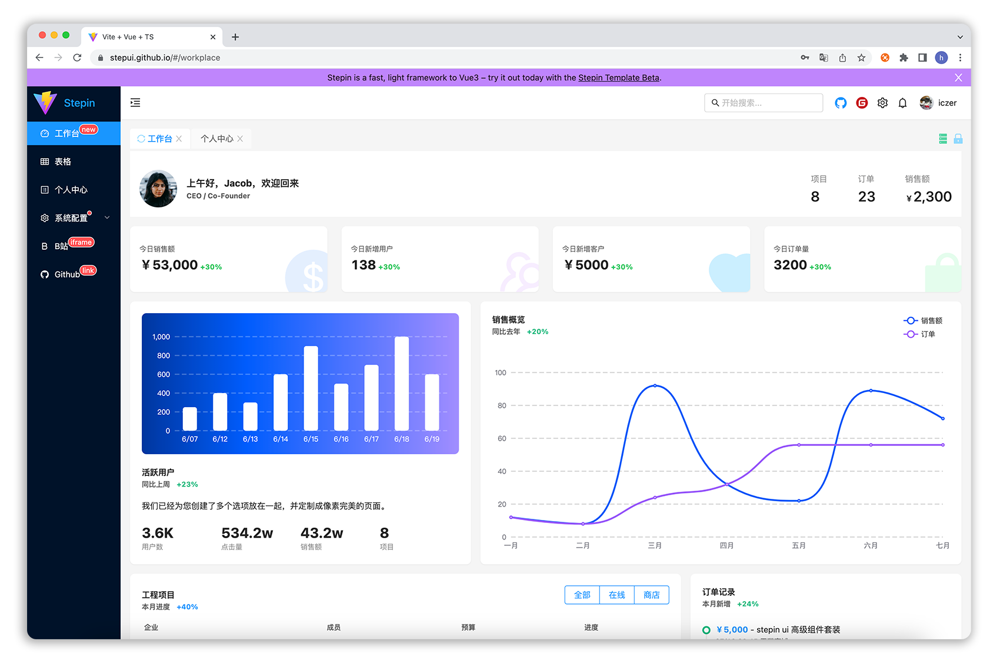

<h1 align="center">Stepin Template</h1>

<div align="center">

开箱即用的中后台前端/设计解决方案
<br/>
(原[ Vue Antd Admin](https://github.com/iczer/vue-antd-admin/) Vue3 版本)


 

</div>

English | [简体中文](./README.md)

- 预览地址: https://stepin-template.pages.dev
- 使用文档: https://docs.stepin-template.pages.dev
- 常见问题: https://docs.stepin-template.pages.dev/issue
- 国内镜像: https://gitee.com/stepui/stepin-template

## 特性

- 强大的主题定制功能，实时动态切换
- 多页签功能，助力后台管理高效开发
- 内置权限控制，兼容 ABAC 和 RBAC 模型
- 丰富的内置业务组件和常用页面模板

## 浏览器支持
| [](http://godban.github.io/browsers-support-badges/)</br>Edge | [](http://godban.github.io/browsers-support-badges/)</br>Firefox | [](http://godban.github.io/browsers-support-badges/)</br>Chrome | [](http://godban.github.io/browsers-support-badges/)</br>Safari | [](http://godban.github.io/browsers-support-badges/)</br>Opera |
| --- | --- | --- | --- | --- |
| last 2 versions | last 2 versions | last 2 versions | last 2 versions | last 2 versions |
## 环境要求

|git|node|yarn|
|---|----|----|
|`^2.15.0`|`^16.14.0`|`^1.21.1`|

## 使用

### 拉取代码

```bash
git clone https://github.com/stepui/stepin-template.git
```

### 安装依赖

```bash
yarn install
```

### 启动

```
yarn dev
```

### 预览

启动成功后，控制台会显示本地访问地址：http://127.0.0.1:5173，浏览器打开即可预览。

更新多信息请参考 [使用文档](http://stepui.gitee.io/stepin-template-docs/)

## 参与贡献

我们非常欢迎你的贡献，你可以通过以下方式和我们一起共建 :star2:：

- 在你的公司或个人项目中使用 Stepin Template。
- 通过 [Issue](https://github.com/stepui/stepin-template/issues/new) 报告:bug:或进行咨询。
- 提交 [Pull Request](https://github.com/stepui/stepin-template/pulls) 改进 Stepin Template 的代码。
- 加入社群，与小伙伴们一同交流心得。QQ 群：441231578

## 打赏作者
如果该项目对您有所帮助，可以请作者喝一杯咖啡。
<p>
  
  
</p>
